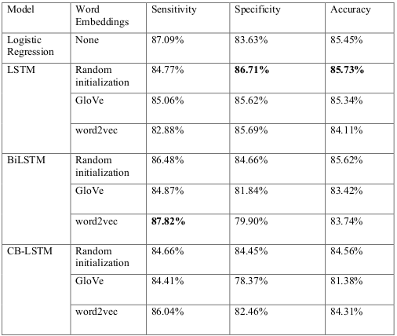
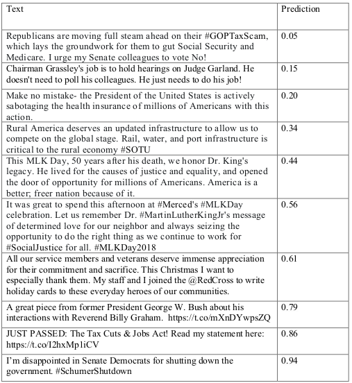
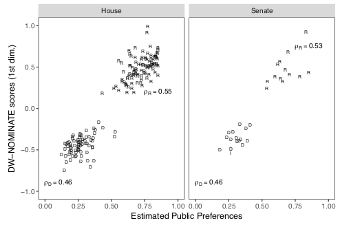

# deepIdeology: Scale ideological slant of Tweets

This package allows users to identify the ideological leanings of Twitter posts with benchmark accuracy
using a Long Short-Term Memory recurrent neural network model trained on a data set of Tweets labeled through
the Amazon Mechanical Turk crowd-sourcing platform. The best-performing model is able to classify Tweets as 
liberal- or conservative-leaning with 86.90% accuracy and is capture both directionality and degree of
slant (see "Performance and Validation" below. This package was developed for a study of preference falsification on social media entitled "Private Partisan, 
Public Moderate: Preference Falsification on Twitter" (Gottlieb, 2018). Contact maintainer to request access.

## Installation and setup

To install the latest version of `deepIdeology` from GitHub, run the following:
```{r}
devtools::install_github("alex-gottlieb/deepIdeology")
library(deepIdeology)
```
Following successful installation run the `complete_setup()` command, which will finish installing the `keras` module and set up the file caching
on which the package relies.

## predict_ideology

`predict_ideology` is the core function of this package. It allows the user to scale the ideological slant of Tweets from 0 to 1, with values close 
to 0 indicating a strong liberal slant, values close to 1 indicating a strong conservative slant, and values around 0.5 indicating ideologically moderate or neutral content. The first time this function is called, it will likely take upwards of an hour to run, as the model will need to be trained and the word embeddings which are required to vectorize the raw text of the Tweets will need to be either downloaded (GloVe) or learned by another neural network
model (word2vec). Once a particular model or embedding configuration is used once, though, the files will be cached, allowing near-instantaneous
evaluations in the future. 

The parameters of the function deserve a little further explanation. The best-performing parameters are set as the defaults of the function, so readers not interested in the technical details can skip this section.
* `model` allows the user to select the particular neural network architecture used in the slant classifier:
    + `LSTM` stands for Long Short-Term Memory Network, a type of recurrent neural network that can learn contextual information in text, or related bits of information separated by a wide spatial or temporal gap. (Hochreiter and Schmidhuber 1997).
    + `BiLSTM` is a Bidirectional LSTM (Graves and Schmidhuber 2005). In this architecture, two LSTM units are trained: one on the text as-is, and one on a reverse copy of the input sequence, which allows the network to place a given word in the context of what comes both before and after it.
    + `C-BiLSTM` is a Convolutional Bidirectional LSTM (Xi-Lian, Wei, and Teng-Jiao 2017), which can learn target-related context and semantic representations simultaneously.
* `embeddings` determines which type of word embedding is used. Word embeddings are a means of transforming raw text into *d*-dimensional numeric vectors that a machine can understand. A straight-forward primer on word embeddings and common models can be found [here](https://machinelearningmastery.com/what-are-word-embeddings/)
    + `GloVe` is a count-based model, which learns embeddings through dimensionality reduction on the co-occurrence count matrix of a corpus (Pennington, Socher, and Manning 2014). The networks in this package use GloVe embeddings calculated from a corpus of 2 billion Tweets. More information can be found [here](https://nlp.stanford.edu/projects/glove/).
    + `w2v` or word2vec is a predictive model, which means it learns the embeddings that minimize the loss of predicting each word given its context words and their vector representation (Mikolov et al. 2013). If word2vec embeddings are chosen, a separate neural network model will be trained to learn the word embeddings.
    + `random` uses an embedding layer with a random initialization, which is then learned in the course of the regular model training.
* `embedding_dim` is the dimensionality of the vector space into which each word is projected. In general, higher-dimensional embeddings can capture more semantic subtleties, but also require more training data to discover those nuances. For the sake of making functions more generalizable, options are restricted to 25, 50, 100, and 200.
* `filter_political_tweets` gives users the option to remove Tweets that are non-political in nature before slant-scaling if there is there possibility that those Tweets are contained in the data set. This is done using a separate classifier also trained on Tweets labeled as "political" or "not political" through Amazon Mechanical Turk.

A toy example:
```{r}
tweets <- c("Republicans are moving full steam ahead on their #GOPTaxScam, which lays the groundwork for them to gut Social Security and Medicare. I urge my Senate colleagues to vote No!",
             "This MLK Day, 50 years after his death, we honor Dr. King's legacy. He lived for the causes of justice and equality, and opened the door of opportunity for millions of Americans. America is a better, freer nation because of it.",
             "I’m disappointed in Senate Democrats for shutting down the government. #SchumerShutdown")

predict_ideology(tweets)
```

#### Caveats
The data set on which the models are trained is roughly 75 percent Tweets from "elite" users (e.g. politicians, media outlets, think tanks, etc.), with the remaining 25 percent coming from "mass" users. In validating the models, it became apparent that they were much more capable of identifying slant from the former group, which in many ways presents an idealized scenario of clearly- (and often forcefully-) articulated ideological leanings along with (mostly) consistent grammar and spelling. Predictions of "mass" Tweets were largely clustered around the middle of the spectrum, not because they were necessarily more moderate, but because the models could not make a confident prediction either way. Accordingly, researchers should use caution when using this package to scale Tweets from groups other than poltiical elites.

Additionally, the Tweets used to train the models were scraped and labeled in early 2018. The ideological spectrum is, of course, not a static entity, and where particular issues and actors fall on that spectrum can shift over time. Additionally, new issues and actors have emerged on the political scene since this data was collected, so stances on more recent topics (e.g. Brett Kavanaugh or the Green New Deal) that might provide a great deal of information to a political observer about someone's leanings would not provide any additional information to the model. 

Both of these issues can be addressed with the continued augmentation of the training data set with labeled examples, so if anyone is interested in continuing this work, please be in touch!

## Performance

The predictive accuracy of various model/embedding combinations on a set-aside testing data set are shown below in Table 1.  Note that a full hyperparameter optimization was not performed for any of the neural network models, so these numbers can be considered lower-bound estimates of the predictive power of the respective model configurations, and comparisons between models should be taken with a grain of salt. 

## Validation

A number of tests were performed to validate the quality of predictions. Table 2 shows a simple face validity test in which 1 Tweet from the "elite" user pool is sampled from each decile of prediction (i.e. [0, 0.1), [0.1, 0.2),...,[0.9, 1]). 
Based on this random sample, it would appear that the model captures both directionality and degree of slant, with Tweets predicted around 0.5 betraying little deological leaning and getting progressively more liberal and conservative as values approach 0 and 1, respectively. It even seems as if it is capable of scaling Tweets for which a high level of political knowledge, long-term memory, and careful reading of tone would be required to understand the slant. For example, the message “Chairman Grassley's job is to hold hearings on Judge Garland. He doesn't need to poll his colleagues. He just needs to do his job!” has a predicted probability of around 0.15. To understand that this Tweet is liberal in nature, one would have to know the fact that Chuck Grassley is a conservative Republican senator, to remember that “Chairman Grassley” is the antecedent of the pronoun “he”, which comes much later in the Tweet, and to understand that the tone of the sentences beginning with “he” is highly disapproving.

As a more rigorous test, estimates were validated against existing and widely-accepted measures of ideological preferences. Figure 1 shows the correlation between the mean predicted ideology of 200 Tweets for members of Congress and the first dimension of their DW-NOMINATE score, which is based on the roll-call voting patterns of members of Congress (Poole and Rosenthal 1997). 
The correlation between Twitter-based estimates and the first dimension of the DW-NOMINATE scores for the 114th Congress is $\rho=0.947$ for the House of Representatives and $\rho=0.937$ for the Senate, values roughly equal with the Twitter-based Bayesian ideal points calculated by Barbera (2015) as well as those derived from Facebook "like"-ing data by Bond and Messing (2015).
